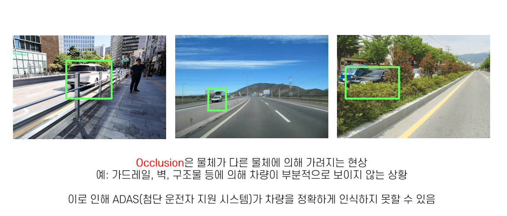
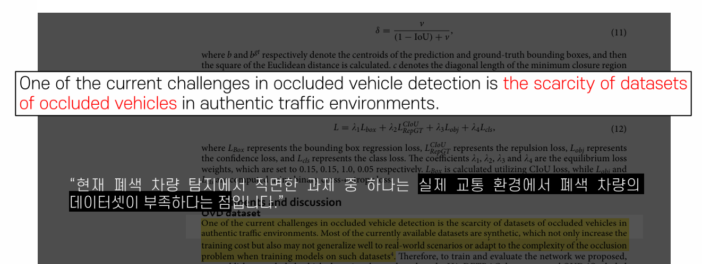
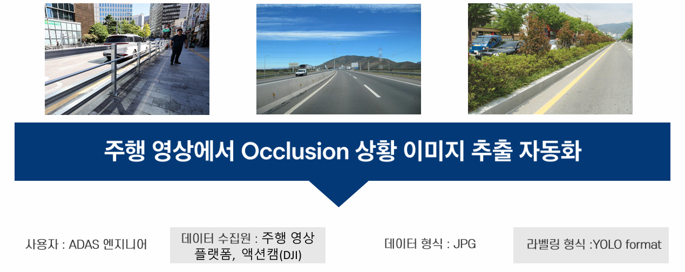
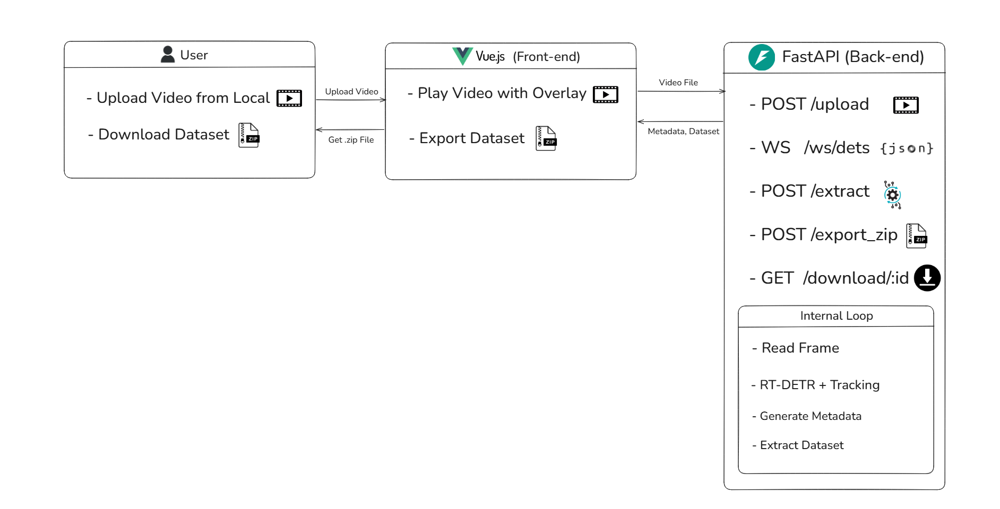
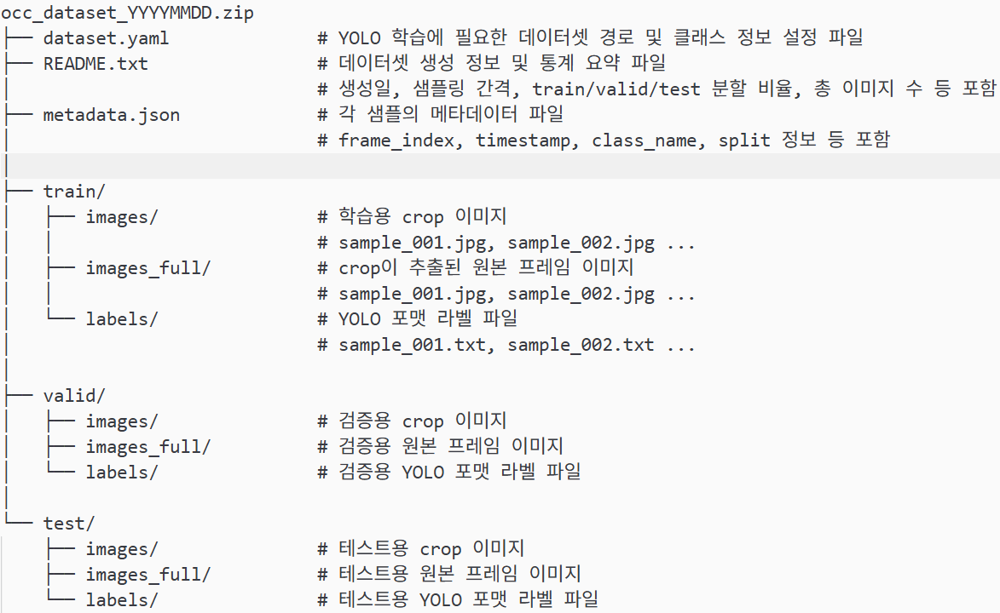
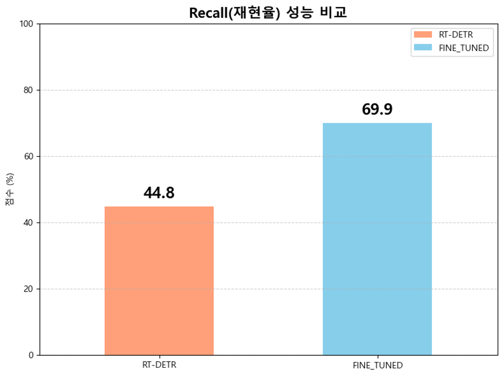
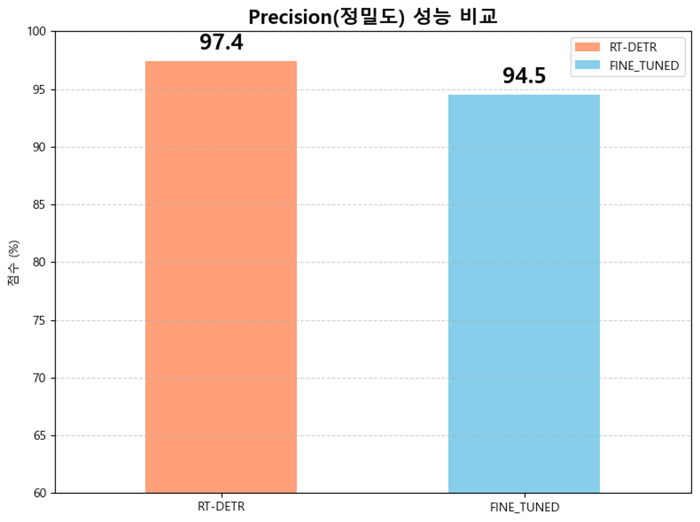

# Occlusion Dataset Generator

> 주행 영상 속 **Occlusion 차량 이미지**를 자동 추출하여  
> **ADAS(첨단 운전자 지원 시스템) 학습용 데이터셋**을 생성하는 프로젝트

---

## Occlusion이란?

---

## ❗ Problem

- 실제 도로 환경에서는 차량이 구조물·가드레일 등에 의해 부분적으로 가려지는 Occlusion 상황이 자주 발생하며, 이는 ADAS 객체 탐지 성능 저하의 원인이 됩니다.
- 그러나 이러한 Occlusion 상황에 대한 학습용 데이터셋은 상대적으로 부족한 문제가 존재합니다.

### Reference
- [Paper Link](https://www.nature.com/articles/s41598-024-70695-x)

---

## 📌 프로젝트 목표

---

## 🛠 사용 기술

- Python (백엔드, AI)
- FastAPI (백엔드, 서버)
- Vue.js (프론트엔드)
- YOLO Format (데이터셋 라벨 포맷)
- RT-DETR (AI 추론 모델)
- SigLIP (추가 오픈소스 AI 모델)

---

## 💻 시스템 아키텍처

## 👤 나의 역할

- 기업 요구사항 분석
- 서비스 흐름 기획
- 시스템 아키텍처 설계
- 프로젝트 관리
- 웹 개발 (Vue.js)
- AI 모델 비교 및 성능 개선 방향 검토

---

## 🔄 Workflow

1. 주행 영상 업로드
2. AI 기반 Occlusion 차량 탐지
3. Occlusion 이미지 자동 추출
4. 데이터셋 생성 및 미리보기
5. ZIP 파일 다운로드

---

## ZIP 파일 구조

---

## 📈 AI 모델 파인튜닝 결과

- 약 40,000장의 Occlusion 이미지를 활용하여 RT-DETR-l 모델을 추가 학습(Fine-Tuning)하였으며,
기본 모델인 RT-DETR-xl과 동일한 주행 영상에서 성능을 비교한 결과입니다.

### Recall

- 전체 주행 영상에서 실제로 등장한 가려진 차량 중, 모델이 올바르게 탐지한 비율입니다.
- 즉, 가려진 차량을 놓치지 않고 얼마나 잘 찾아냈는지를 나타냅니다.

### Precision

- 모델이 가려진 차량이라고 판단한 결과 중, 잘못 탐지가 아닌 비율입니다.
- 즉, 모델의 탐지 결과가 얼마나 정확한지를 나타냅니다.
- 그러나 Recall을 높이는 과정에서 trade-off로 Precision이 소폭 감소하였습니다.
- 이를 보완하기 위해 추가 오픈소스 AI 모델인 **SigLIP**을 활용하여 잘못 탐지된 구조물 이미지나 학습 데이터로서 품질이 낮은 이미지를 추가적으로 필터링하였습니다.

### SigLIP

- 이미지와 자연어를 함께 이해할 수 있는 AI 모델로, 자연어 프롬프트를 통해 원하는 조건의 이미지를 선별하는 데 활용하였습니다.
---

## 📊 결론

- Occlusion 이미지 추출 자동화
- 데이터셋 생성 프로세스 구축
- 기업 대상 AI 활용 가능성 제안
- 실제 ADAS 환경에서 활용 가능한 데이터 구축 자동화 가능성 확인
